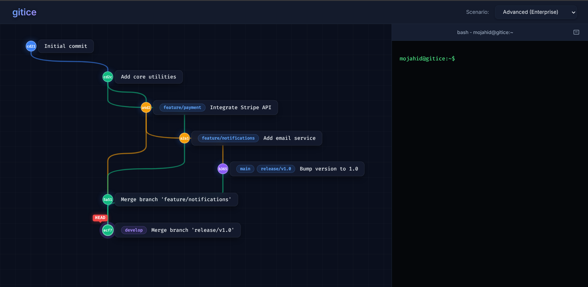

# Gitice — Git Visual Simulator



> **Learn Git interactively** — a browser-based Git simulator that visualizes branches, commits, merges, and more in real time.

**Live:** [gitice.pages.dev](https://gitice.pages.dev)

---

## Features

### Visual Git Graph
Every commit, branch, and merge is rendered as an interactive graph. Nodes are color-coded by branch, with connecting curves showing parent relationships. Click a node to copy its hash; right-click for actions.

### Built-in Scenarios
Load pre-built Git histories to explore different workflows:

| Scenario | Description |
|----------|-------------|
| **Simple (Linear)** | A linear commit history on `main` |
| **Intermediate (Branching)** | Feature branch with merge back to `main` |
| **Complex (Collaborative)** | Multiple feature branches, develop branch, and a hotfix |
| **Advanced (Enterprise)** | Release branches, feature branches, and cross-branch merging |
| **Custom (Sandbox)** | Start from scratch and build your own history |

### Git Commands
Type any Git command in the terminal and see the graph update instantly:

- `git init` — Initialize a repository
- `git commit -m "msg"` — Create a commit
- `git branch <name>` — Create, rename (`-m`), or delete (`-d`/`-D`) branches
- `git checkout <branch>` — Switch branches, create with `-b`
- `git switch`, `git restore` — Branch switching and file restoration
- `git merge <branch>` — Merge branches (fast-forward and recursive)
- `git rebase <branch>` — Rebase current branch onto another
- `git cherry-pick <commit>` — Apply a commit's changes
- `git revert <commit>` — Revert a commit
- `git reset [--soft|--mixed|--hard]` — Reset HEAD
- `git stash [pop|clear]` — Stash and unstash changes
- `git log [--oneline|--graph]` — View commit history with ASCII graph
- `git status`, `git add`, `git rm` — File tracking

### Shell Commands
- `ls`, `cd`, `pwd`, `clear` — Navigate the virtual filesystem

### UI Controls
Toolbar buttons and right-click context menu for quick actions:
- **✏️ Modify** — Simulate editing a file (appears in unstaged changes)
- **📦 Stage** — Stage all unstaged changes
- **➕ Commit** — Commit with a message
- **🌱 Branch** — Create and optionally switch to a new branch
- **🔄 Checkout** — Switch branches or commits
- **🔀 Merge** — Merge a branch into the current one

Every UI action echoes the equivalent command in the terminal.


## Project Structure

```
├── index.html      # Main HTML
├── styles.css      # All styling
├── script.js       # Application logic (~1600 lines)
├── assets/
│   └── site_demo.png
├── logo.png
└── README.md
```
